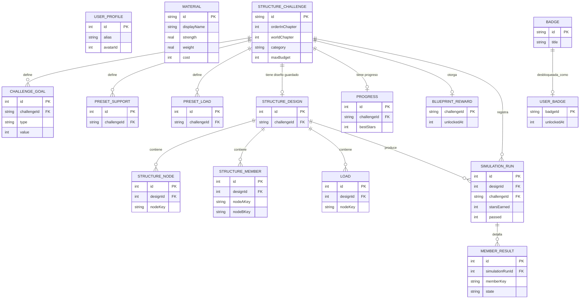

# Base de Datos — Constructópolis

Motor: SQLite vía Room 2.6.1. Base de datos única `constructopolis.db`, 16 tablas (13 entidades "de dominio" + 3 tablas de detalle de reto). Ver `database/schema.sql` para el DDL completo y `database/sample_data.sql` para datos de ejemplo.

## 1. Tablas

### user_profile (perfil local, fila única)
| Campo | Tipo | Notas |
|---|---|---|
| id | INTEGER PK | Fijo = 1 (fila única) |
| alias | TEXT | Nunca nombre real |
| avatarId | INTEGER | Índice 0-7 de avatar local |
| soundEnabled | INTEGER (bool) | |
| hapticEnabled | INTEGER (bool) | |
| onboardingCompleted | INTEGER (bool) | |
| createdAt | INTEGER | epoch millis |

### material (catálogo, semilla)
`id` (PK, "MADERA"/"ACERO"/"CONCRETO"), `displayName`, `description`, `strength` REAL, `weight` REAL, `cost` INTEGER, `colorHex`, `iconRes`.

### structure_challenge (catálogo de retos, semilla)
`id` (PK), `orderInChapter`, `worldChapter`, `title`, `briefing`, `category`, `gridWidth`, `gridHeight`, `maxBudget`, `starThreshold2`, `starThreshold3`, `allowedMaterialsCsv`, `iconRes`.

### challenge_goal (N:1 → structure_challenge, `ON DELETE CASCADE`)
`id` PK autogen, `challengeId` FK, `type` TEXT (`ALTURA_MINIMA` | `PRESUPUESTO_MAXIMO` | `RESISTIR_CARGA_LATERAL` | `TRIANGULACION_MINIMA` | `PESO_MAXIMO` | `ESTABILIDAD_MINIMA`), `value` INTEGER.

### preset_support / preset_load (N:1 → structure_challenge, `ON DELETE CASCADE`)
Apoyos y cargas ya colocados por el reto (no editables por el jugador).

### structure_design (1:1 con un reto por partida en curso, `ON DELETE CASCADE` desde structure_challenge)
`id` PK autogen, `challengeId` FK **único**, `createdAt`, `updatedAt`.

### structure_node / structure_member / load (N:1 → structure_design, `ON DELETE CASCADE`)
Lo que el jugador dibuja en el Constructor. `nodeKey`/`memberKey`/`loadKey` son los identificadores lógicos usados por `StructureEngine` (p. ej. "A", "m3").

### simulation_run (N:1 → structure_design y → structure_challenge, `ON DELETE CASCADE`)
Un registro por cada vez que el jugador pulsa "Probar": resultado completo (conectado, estable, aprobado, estrellas, altura, costo, peso, estabilidad, % triangulación, feedback).

### member_result (N:1 → simulation_run, `ON DELETE CASCADE`)
Resultado por miembro de una simulación concreta (carga asignada, capacidad, ratio, estado).

### progress (1:1 por reto)
`challengeId` FK **único**, `started`, `completed`, `bestStars` (nunca decrece), `attempts`, `lastPlayedAt`.

### blueprint_reward (1:1 por reto, semilla + desbloqueo)
`challengeId` PK/FK, `title`, `description`, `iconRes`, `unlockedAt` (NULL hasta la primera aprobación).

### badge (catálogo, semilla) / user_badge (desbloqueadas)
`badge.id` PK ("PRIMER_LADRILLO", ...). `user_badge.badgeId` PK/FK **único** (evita duplicados), `unlockedAt`.

## 2. Restricciones e índices relevantes

- Índices únicos: `structure_design.challengeId`, `progress.challengeId`, `blueprint_reward.challengeId`, `user_badge.badgeId`.
- Todas las claves foráneas usan `ON DELETE CASCADE`: borrar un reto elimina sus objetivos/apoyos/cargas/plano/diseños; borrar un diseño elimina sus nodos/miembros/cargas/simulaciones; borrar una simulación elimina sus resultados por miembro.
- `blueprint_reward.unlockedAt` solo se actualiza si estaba en NULL (`UPDATE ... WHERE unlockedAt IS NULL`), garantizando que la fecha de desbloqueo sea siempre la primera.
- `user_badge` usa `INSERT ... OR IGNORE` sobre PK para que una insignia nunca se "re-desbloquee".

## 3. Consultas importantes

```sql
-- Mejor puntaje de estrellas obtenido en un reto (ignora intentos no aprobados)
SELECT MAX(starsEarned) FROM simulation_run WHERE challengeId = :id AND passed = 1;

-- Retos completados de un capítulo (para la insignia "Cimientos Dominados")
SELECT COUNT(*) FROM progress p
INNER JOIN structure_challenge c ON p.challengeId = c.id
WHERE c.worldChapter = :chapter AND p.completed = 1;

-- Costo vs. presupuesto de cada intento aprobado (para la insignia "Ingeniera Ahorradora")
SELECT sr.totalCost, sc.maxBudget FROM simulation_run sr
INNER JOIN structure_challenge sc ON sr.challengeId = sc.id
WHERE sr.passed = 1;
```

## 4. Datos semilla

Generados por `tools/generate_seed.py` y cargados por `Seeder.kt` (solo si las tablas están vacías): 3 materiales, 40 retos (5 capítulos × 8 retos, con objetivos/presupuesto/materiales permitidos que varían por reto), 10 insignias, 40 planos coleccionables (uno por reto).

## 5. Diagrama entidad-relación


